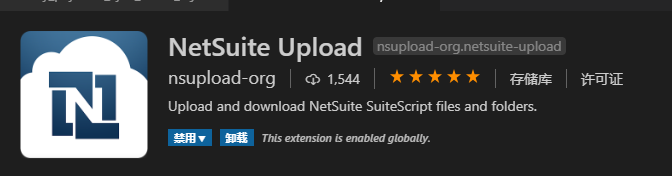
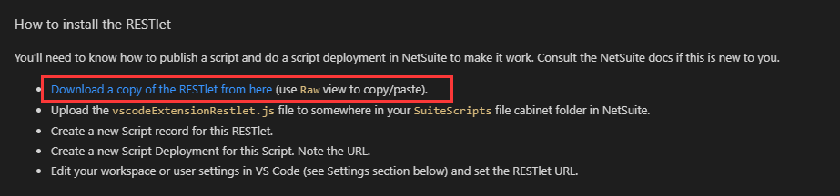
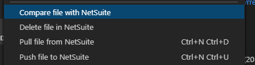

> 第一步：下载拓展



> 第二步：下载`RESTlet.js`（`vscodeExtensionRestlet.js`）文件,在拓展的细节页面有git的最新下载地址，当不可用时请前往git下载最新版，并请`将该文件部署到ns系统`，`创建脚本记录`。得到其`外部URL`。



> 地址：`https://github.com/netsuite-upload-org/netsuite-upload/blob/master/netSuiteRestlet/vscodeExtensionRestlet.js`

> 第三步：配置`settings.json`文件,加入如下类容

1. 部署 `vscodeExtensionRestlet.js`脚本，将其外部URL设置给 `netSuiteUpload.restlet`

```json
	// Script Deployment URL for the deployed vscodeExtensionRestlet.js
    "netSuiteUpload.restlet": "xxxx",  	// vscodeExtensionRestlet.js 部署外部url（项目不同需要更改）
```

​    2.设置上传下载文件的`文件柜根目录`，默认`SuiteScripts`

```json
    // Base NetSuite folder path to upload script to. Default if unset is "SuiteScripts".
    "netSuiteUpload.rootDirectory": "xxxx", //文件柜根目录 要与本地文件目录结构相同（项目不同需要更改）
```

   3.设置`文件比对`的`文件柜文件下载临时存放`目录

```json
	// Temporary folder - used for diffing files between local and remote.
    "netSuiteUpload.tempFolder": "xxx",  // 本地文件与文件柜文件比对，下载的文件柜文件存放目录
```

​	4.设置OAuth权限验证的密钥，秘密

> `ps`: 新建管理集合时，请勾选（`基于令牌的身份验证 (TBA)`），并去掉勾选（`TBA：授权流程`），
>
> 请`注意保存如下四个密钥`，因为只有首次初始化会显示，后期会隐藏，如忘记密钥，只能重新生成。

```json
	// If using OAuth, set all of these.
    // Oauth NetSuite Key or Token ID
    "netSuiteUpload.netSuiteKey": "xxx",//设置/用户角色/访问令牌/新建 令牌ID（）
    // Oauth NetSuite Secret
    "netSuiteUpload.netSuiteSecret": "xxx", //设置/用户角色/访问令牌/新建 令牌秘密
    // Oauth NetSuite Consumer Key
    "netSuiteUpload.consumerToken": "xxx",// 设置/集成/管理整合/新建  顾客密钥
    // Oauth NetSuite Consumer Secret
   "netSuiteUpload.consumerSecret": "xxx", // 设置/集成/管理整合/新建 消费者密钥
```

5.设置公司科目ID，也就是NS数字化账号

```json
	// Account number
    "netSuiteUpload.realm": "xxx",  //   设置/公司/公司资料/科目ID
```

> 第四步：动手开发吧。你已经完成了全部的配置，可以开心的玩了。

基本使用命令：ctrl+shift+p  输入命令，这可以让你添加模块

基本使用：




- `Pull file from NetSuite` - downloads a file from NetSuite
- `Push file to NetSuite` - uploads a file to NetSuite
- `Delete file in NetSuite` - deletes a file in NetSuite
- `Compare file with NetSuite` - diff your local version with the NetSuite version
- `Pull folder from NetSuite` - Download the folder and all contents from NetSuite

> PS：之前的版本有个小bug，当使用ctrl+shift+p添加模块时，只会将模块附加到function里面，无法附加进define里面，作者已经修复此bug（不是作者本人，是使用这个拓展的以为大佬），有想法的可以自己去这里查看修复过程讲解。地址：https://github.com/netsuite-upload-org/netsuite-upload/issues/31
>

- 第一步：文件路径  `C:\Users\11745\\.vscode\extensions\nsupload-org.netsuite-upload-1.2.3\helpers`，找到`codeChangeHelper.js`脚本，修改其中的`editCurrentDocument`方法如下：

  ```javascript
  async function editCurrentDocument(vsEditor, coords, content){
      var vsDocument = getDocument(vsEditor);
      var edit = setEditFactory(vsDocument._uri, coords, content);
      var didApply = false;
      didApply = await vscode.workspace.applyEdit(edit);
       return didApply;
  }
  ```

  同时，修改方法`updateDocument` 如下：

  ```javascript
  async function updateDocument(editor, startLine, startChar, endLine, endChar, content) {
      var editorCoords = {
          start : {
              line: startLine,
              char: startChar
          },
          end : {
              line: endLine,
              char: endChar
          }
      }
      
      var didApply = false; 
  	didApply = await editCurrentDocument(editor, editorCoords, content);
  	return didApply;
  }
  ```

- 第二步 找到`netSuiteBl.js`脚本，修改方法`addDependency` 如下：

  ```javascript
  async function addDependency(editor, pathText, paramText) {
      let docContent = editor.document.getText();
      
  	let coords = codeChangeHelper.getCoords(docContent);	
      let oldParamsString = docContent.substring(coords.depParam.range[0], coords.depParam.range[1]);
      let newParamsString = codeChangeHelper.getUpdatedFunctionParams(paramText, oldParamsString);
  
      let newPathArrayString = codeChangeHelper.getUpdatedDepPath(pathText,
          coords.depPath ? docContent.substring(coords.depPath.range[0], coords.depPath.range[1]) : null);
   
      if (coords.depPath) {
  		await codeChangeHelper.updateDocument(editor, coords.depParam.start.row - 1, coords.depParam.start.col,
              coords.depParam.end.row - 1, coords.depParam.end.col, newParamsString);
  			
          await codeChangeHelper.updateDocument(editor, coords.depPath.start.row - 1, coords.depPath.start.col,
              coords.depPath.end.row - 1, coords.depPath.end.col, newPathArrayString);
  
      } else { // Path array not defined
          await codeChangeHelper.updateDocument(editor, coords.depParam.start.row - 1, coords.depParam.start.col,
              coords.depParam.end.row - 1, coords.depParam.end.col, newPathArrayString + ', ' + newParamsString);
      }
  	
  	return true;
  }
  
  ```

  ## 上述配置均设置完毕以后，就可以使用VS CODE进行NetSuite开发了。